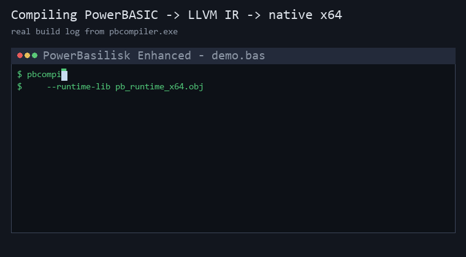

# PowerBasilisk Enhanced

[](https://github.com/hanlokesu/powerbasilisk/actions/workflows/ci.yml)
[](https://github.com/hanlokesu/powerbasilisk/releases)
[](LICENSE)




An enhanced 64-bit PowerBASIC compiler, forked from
[`benstopics/powerbasilisk`](https://github.com/benstopics/powerbasilisk).

**PowerBasilisk** is an open-source compiler that translates PowerBASIC source
code (`.bas`) into LLVM IR and then into native 64-bit Windows executables.
The toolchain is written in Rust and has zero external crate dependencies.

This repository is an **enhanced branch** that fixes an upstream bug and adds
several frequently-used PowerBASIC statements/functions that were previously
silently dropped during code generation.

---

## What's New vs. Upstream

### Fixed
- **`-lui` link flag bug** — removed a stale `-lui` from the exe linker
  arguments. Modern Windows SDKs no longer ship `ui.lib`, so the upstream
  linker command failed whenever `--lib-dir` was used. This branch links
  correctly against current Windows SDKs.
- **Auto-detect the Windows SDK** — `--lib-dir` is now optional. When it is
  omitted, the compiler scans the standard install roots
  (`C:\Program Files (x86)\Windows Kits\10\Lib` and the 64-bit sibling) and
  picks the **newest installed SDK version** whose `um\x64` folder exists, so
  each user does not need to know their SDK version number. If no SDK is
  found, a warning is printed and linking will fail with a clear message.

### New Built-ins (previously silently discarded)
| PB statement / function | Maps to | Notes |
| --- | --- | --- |
| `MSGBOX text$ [, style& [, title$]]` | `MessageBoxA` (user32) | modal message box |
| `SHELL command$ [, mode&]` | `ShellExecuteA` (shell32) | launch a program / document |
| `CURDIR$` | `GetCurrentDirectoryA` (kernel32) | current working directory (no-parens call supported) |
| `ISFILE(path$)` | `_access` (C runtime) | returns -1 if the file exists, 0 if not |
| `REPLACE old$ WITH new$ IN target$` | `pb_replace` (runtime) | replace every occurrence of `old$` in `target$` |
| `ERASE array` | `pb_erase_array` (runtime) | zero numeric arrays, null string arrays (static arrays) |
| `LSET var$ = expr` | `pb_lset` / `pb_lset_buf` (runtime) | left-justify into a fixed-length string, pad with spaces |
| `RSET var$ = expr` | `pb_rset` / `pb_rset_buf` (runtime) | right-justify into a fixed-length string, pad with spaces |
| `WRITE #f, ...` | `pb_write_file_*` (runtime) | CSV-style record output: strings quoted, numbers raw, CRLF row terminator |
| `SEEK #f, pos` | `pb_seek` (runtime) | 1-based byte repositioning (`fseek` under the hood) |
| `LOCK #f [, rec [, len]]` | `pb_lock` (runtime) | byte-range file lock via CRT `_locking` |
| `UNLOCK #f [, rec [, len]]` | `pb_unlock` (runtime) | release a byte-range file lock |
| `RESET` | `pb_reset` (runtime) | close every open file handle |
| `FLUSH #f` | `pb_flush` (runtime) | `fflush` a file buffer to disk |
| `NAME old$ AS new$` | `pb_name` (runtime) | rename a file (`rename`) |
| `ON GOTO` | computed `switch`-style branch | jump to one of N labels selected by a 1-based index |
| `ON GOSUB` | computed `GOSUB` + `RETURN` | call one of N subroutines selected by a 1-based index |
| `CLIPBOARD SET TEXT / GET TEXT / RESET` | Win32 clipboard | text to/from the system clipboard |
| `INPUT FLUSH` | `pb_input_flush` (runtime) | discard buffered console input |
| `OPTION EXPLICIT` / `REM` / `GLOBAL` | accepted | declarations and comments parse cleanly |

> **Why this matters:** upstream `pbcompiler` would report "compiled
> successfully" while silently dropping these calls at codegen time — > `Unknown sub — skip` for bare statements and `Unknown function — 0` for
> expressions. Programs built this way ran but did nothing. This branch wires
> them to real Win32 / CRT calls and is verified against running executables.

### Diagnostics: know when your code is silently dropped
Upstream would compile a `.bas` that uses an unimplemented statement, produce
a working `.exe`, and never tell you that whole lines of your code did
nothing. This branch adds an **unimplemented-statement report**:

- Every statement that is parsed but produces **no code** is recorded.
- After each build, the compiler prints a summary to stderr:
  `[pbcompiler] WARNING: N statement(s) not implemented (silently dropped)`.
- A full report is written next to your output, e.g.
  `program.unimplemented.log`, listing **the source line and the statement
  name** for every silent drop, so you can tell exactly what will not run.

Example report from a program using DDT GUI statements:

```text
PowerBasilisk Enhanced - unimplemented / silently-dropped statement report
3 statement(s) parsed but produced NO code. These make the .exe run but do nothing.
Check each line below against your source:
  line 5: statement `DIALOG` parsed but NOT implemented (NOOP) - no code generated
  line 6: statement `XPRINT` parsed but NOT implemented (NOOP) - no code generated
  line 7: statement `GARBAGE_STMT` has no codegen implementation - skipped
```

This covers all three silent-drop paths: parser-level `NOOP`s (known but
unimplemented statements), bare statements with no codegen (`Unknown sub`),
and expression functions with no implementation (`Unknown function — 0`).

### Implementation notes (gotchas fixed)
- **LSET / RSET memory model.** A PowerBASIC fixed-length string
  (`STRING * N`) is a **direct char buffer**, not a `BSTR` pointer variable.
  The first attempt used `pb_lset(char**, ...)` (pointer-to-pointer) and
  produced garbage. The fix is a buffer variant (`pb_lset_buf` / `pb_rset_buf`)
  that writes straight into the fixed buffer, selected automatically based on
  the target variable's type.

---

## Getting Started (new users)

**Option A — no toolchain needed (recommended): download the prebuilt
package from [Releases](https://github.com/hanlokesu/powerbasilisk/releases).**
Pick the latest `PowerBasilisk-Enhanced-vX.Y.Z-x64.zip`; it already contains
the compiled `pbcompiler.exe`, the 64-bit runtime `pb_runtime_x64.obj`, sample
programs and a one-click `compile.bat`. Unzip and run:

```bat
cd PowerBasilisk-Enhanced-v0.1.9-x64
compile.bat          :: builds examples\demo.bas -> examples\demo.exe
```

> **Which download should I use?** The green **Code → Download ZIP** button
> (named `powerbasilisk-main.zip` by GitHub) is the **raw source tree only** —
> no executable inside; it is meant for developers building from source. New
> users who just want to compile PB programs should use the **Releases**
> package instead. (GitHub also auto-attaches "Source code (zip)" archives to
> every Release — those are source-only as well, ignore them.)

**Option B — build from source:** the quickest path on a brand-new machine:

1. **Double-click `setup.bat`** (or run
   `powershell -NoProfile -ExecutionPolicy Bypass -File setup.ps1`).
   It checks for and installs (via `winget`, if missing):
   - Rust toolchain (`Rustlang.Rustup`)
   - LLVM / Clang (`LLVM.LLVM`, ~500 MB download; a UAC prompt may appear
     - click YES)
   - Windows SDK (`Microsoft.WindowsSDK.10.0.26100`)
   Then it builds `pb_runtime_x64.obj` and the release `pbcompiler.exe`
   for you.
2. **Compile your first program:**

   ```bash
   pbcompiler build your_program.bas --exe --target x86_64-pc-windows-msvc --runtime-lib pb_runtime_x64.obj
   ```

   (`--lib-dir` is optional — the compiler auto-detects the Windows SDK.)

That is all a new user needs to know. The sections below explain the build
in detail for contributors.

---

## Build

Prerequisites: a Rust toolchain (`rustup`) and, for linking, LLVM/Clang.

```bash
# inside the workspace root (pbsrc/)
cargo build --release -p pbcompiler
# binary: target/release/pbcompiler.exe
```

## Usage

Compile a PB program to a 64-bit exe:

```bash
pbcompiler build program.bas --exe \
  --target x86_64-pc-windows-msvc \
  --runtime-lib pb_runtime_x64.obj \
  --lib-dir "<Windows SDK>\Lib\<ver>\um\x64"
```

- `--runtime-lib` — points to the precompiled `pb_runtime.c` object.
- `--lib-dir`  — optional. Directory containing `user32.lib`,
  `shell32.lib`, etc. Required for `MSGBOX` / `SHELL` / Win32 API usage.
  If omitted, the compiler auto-detects the newest installed Windows SDK.

---

## Verified

All added built-ins are tested by compiling and **running** the generated
64-bit executables:

- `ISFILE` — returns correct result for existing and missing files.
- `CURDIR$` — returns the real current working directory.
- `MSGBOX` — a modal dialog is shown with the correct title.
- `SHELL` — launching `calc.exe` starts the Calculator application.

Tier 2 additions are verified by compiling and running a combined test
program (`test_enhance2.bas`, exit code 0):

- `REPLACE` — `"the cat sat on the cat mat"` — `"the dog sat on the dog mat"`.
- `ERASE` — a `LONG` array's summed elements return 0; a `STRING` array's
  first element length returns 0.
- `LSET` / `RSET` — a `STRING * 10` variable shows left/right-justified text
  padded to exactly 10 characters.

The upstream official test suite (14 programs) continues to build, run, and
pass with exit code 0, and the user's real-world `.bas` files now emit real
`MessageBoxA` / `ShellExecuteA` / `GetCurrentDirectoryA` / `_access` calls
instead of being silently dropped.

**SDK auto-detection verified** - every build listed above (the 14 official
tests, the Tier 2A and Tier 2B tests, the file I/O round trip, and the
user's real-world `.bas` program) was compiled and linked **without
`--lib-dir`**. The compiler auto-detected the newest installed Windows SDK
(`C:\Program Files (x86)\Windows Kits\10\Lib\10.0.26100.0\um\x64` on the
test machine, which also has the older `10.0.19041.0` installed) and
linked every program successfully.

**Tier 2B file-statement test** (`test_tier2b.bas`, exit code 0) covers the
remaining Tier-2 file statements end to end:

- `WRITE #` — writes CSV-style records; reading them back with `LINE INPUT #`
  yields `"hello",42,3.5` and `"world",7` exactly.
- `SEEK #` — repositions to byte 1 and re-reads the first record correctly.
- `LOCK` / `UNLOCK #` — a byte range is locked and released without error.
- `FLUSH #` — buffers are flushed mid-program.
- `NAME ... AS ...` — renames the test file on disk.
- `RESET` — closes every open file handle; the renamed file is then deleted
  with `KILL` and no temporary files remain.

**File I/O round trip** — a full write→read→verify→cleanup cycle passes with
exit code 0:

- `fileio_writer.bas` opens `testdata.txt` `FOR OUTPUT` and writes 9 lines via
  `PRINT #` (text, numbers, a float, loop-built rows, and a line produced by
  the new `REPLACE` statement).
- `fileio_reader.bas` opens it `FOR INPUT`, reads all 9 lines back with
  `LINE INPUT #` inside `WHILE NOT EOF(f)`, verifies the count, then deletes
  the file with `KILL`.
- Every line read back matches what was written, byte for byte. This confirms
  the file pipeline (`FREEFILE`, `OPEN`, `PRINT #`, `LINE INPUT #`, `EOF`,
  `CLOSE`, `KILL`) executes real I/O — not empty shells.

---


## Statement Support Matrix

Status legend: **✅** implemented and verified · **⚠️** parsed but produces
NO code — reported in `*.unimplemented.log` at build time · **🔲** future

> **Official coverage audit** — every keyword below has been checked against
> the PowerBASIC official documentation (MIT-licensed keyword index,
> 735 keywords / 1282 topic pages, PB/Win 10+11 / PB/CC 6+7):
> [**statement-coverage.md**](docs/statement-coverage.md) · full data:
> [**statement-coverage.csv**](docs/statement-coverage.csv).
> Summary: **150** statement-class keywords implemented · **202** DDT/GUI-class
> deferred (Tier 3) · **151** documented upstream with no codegen evidence yet.
> (2026-09-13: +11 official keywords from batch 19 — TCP OPEN/ACCEPT/SEND/RECV/
> LINE INPUT/PRINT/CLOSE + UDP OPEN/SEND/RECV/CLOSE — Winsock sockets, verified
> live via loopback TCP/UDP echo; 2026-09-12: +59 official keywords from batches 1-18 (incl. 29 #-metastatements, all verified accepted) — TIX, MKBYT$, PEEK/POKE,
> SHIFT/ROTATE, DATA/READ/RESTORE, PLAY WAVE/SOUND, SPLIT, ARRAY REVERSE/SHUFFLE,
> CHDRIVE, SETEOF, PUT$, ISINFINITE/ISNORMAL, MKx binary-string family,
> DESKTOP GET CLIENT/LOC/PPI — all sample-verified live.)

### Newly implemented by this branch
| PB statement / function | Status | Maps to |
| --- | --- | --- |
| `TCP OPEN/ACCEPT/SEND/RECV/LINE INPUT/PRINT/CLOSE` | ✅ | Winsock `socket/connect/bind/listen/accept/send/recv/closesocket` + `pb_*` helpers |
| `UDP OPEN/SEND/RECV/CLOSE` | ✅ | Winsock `SOCK_DGRAM` + `sendto/recvfrom`; `UDP SEND AT` accepts LONG or string IP |
| `MSGBOX` / `SHELL` / `CURDIR$` / `ISFILE` | ✅ | `MessageBoxA` / `ShellExecuteA` / `GetCurrentDirectoryA` / `_access` |
| `REPLACE old$ WITH new$ IN target$` | ✅ | `pb_replace` |
| `ERASE array` | ✅ | `pb_erase_array` |
| `LSET var$ = expr` / `RSET var$ = expr` | ✅ | `pb_lset(_buf)` / `pb_rset(_buf)` |
| `WRITE #f, ...` | ✅ | `pb_write_file_begin/str/int/dbl/newline` |
| `SEEK #f, pos` | ✅ | `pb_seek` |
| `LOCK #f` / `UNLOCK #f` | ✅ | `pb_lock` / `pb_unlock` |
| `RESET` / `FLUSH #f` | ✅ | `pb_reset` / `pb_flush` |
| `NAME old$ AS new$` | ✅ | `pb_name` |
| `BEEP` | ✅ | `Beep(800, 300)` (kernel32) |
| `SWAP a, b` | ✅ | register-level load/store exchange |
| `MKDIR` / `RMDIR` / `CHDIR` / `KILL` + `ERR` / `ERRCLEAR` | ✅ | `_mkdir` / `_rmdir` / `_chdir` / `pb_kill` + `@pb_err` global — PB-compatible error codes (75/76/53) on failure |
| Built-in string equates — all 18 ANSI forms (`$CRLF`, `$TAB`, `$DQ`, `$WHITESPACE`, …) | ✅ | compile-time string constants (byte-verified against the official table); `$$` wide single-char forms as numeric constants |
| `CHR$(a, b, c)` multi-argument | ✅ | one byte per argument, concatenated (`CHR$(13,10)` = CR+LF) |
| `RND` bare form (no parens) | ✅ | same as `RND()` — random double in [0,1) |
| `INPUT #f, s$` reading `WRITE #` output | ✅ | CSV double-quotes stripped per PB semantics |
| `PRINT` console output | ✅ | flushed immediately after each line (visible under redirection / on abort) |
| `CLS` | ✅ | `pb_cls` → clears the console screen (PB/CC) |
| `ERROR n` | ✅ | sets the PB error code (readable via `ERR`) |
| `ENVIRON "VAR=value"` | ✅ | `pb_environ_set` → `_putenv`; bare `ENVIRON "VAR"` removes the variable |
| `FILECOPY src$, dst$` | ✅ | `pb_filecopy` → `CopyFileA`, PB-compatible `ERR` on failure (53/70/76) |
| `SETATTR "path", attr&` | ✅ | `pb_setattr` → `SetFileAttributesA`, PB-compatible `ERR` on failure |
| `TIX` | ✅ | `pb_tix` → 64-bit millisecond tick counter |
| `MKBYT$(n)` | ✅ | `pb_mkbyt` → one-byte string |
| `ISINFINITE(x)` / `ISNORMAL(x)` | ✅ | `pb_isinfinite` / `pb_isnormal` — IEEE-754 checks (-1/0) |
| `PLAY WAVE "file.wav"` | ✅ | `PlaySoundA` (async) |
| `PLAY SOUND freq, dur` | ✅ | `Beep(freq, dur)` (kernel32) |
| `CHDRIVE "C:"` | ✅ | `_chdrive` — PB-compatible `ERR` (68) on failure |
| `SETEOF #f` | ✅ | `pb_seteof` → truncates file at current position |
| `SHIFT LEFT/RIGHT var, n` · `SHIFT SIGNED LEFT/RIGHT var, n` | ✅ | `pb_shift_left/right` (logical) + `pb_shift_sleft/sright` (arithmetic) |
| `ROTATE LEFT/RIGHT var, n` | ✅ | `pb_rotate_left/right` (wrapping) |
| `ARRAY REVERSE arr` | ✅ | `pb_array_reverse` — in-place element reversal |
| `ARRAY SHUFFLE arr` | ✅ | `pb_array_shuffle` — in-place Fisher-Yates |
| `PUT$ = ...` | ✅ | `pb_put_string` — string to file (binary) |
| `SPLIT [WORD] src$, a TO b, c` | ✅ | `pb_split` — returns pieces via `PARSE$`-compatible out-params |
| `DATA ...` / `READ var, ...` / `RESTORE` | ✅ | `pb_data_append` / `pb_read_data_str/num` / `pb_data_reset` — DATA pool with cursor + RESTORE rewind |
| `PEEK(datatype, addr)` / `POKE datatype, addr, v, ...` | ✅ | `pb_peek8/16/32/64/f/d` / `pb_poke8/16/32/64/f/d` — BYTE/WORD/DWORD/INTEGER/LONG/QUAD/SINGLE/DOUBLE; addresses are 64-bit (use `QUAD` vars for `VARPTR`) |
| `BIT` function / `BIT SET/RESET/TOGGLE var, n` / `BIT CALC var, n, expr` | ✅ | register-level bit ops (in-place, any integral var) |
| `PROCESS GET PRIORITY TO var` / `PROCESS SET PRIORITY pri` | ✅ | `GetPriorityClass` / `SetPriorityClass` |
| `LOF(f)` / `LOC(f)` / `SEEK(f)` | ✅ | `pb_lof` / `pb_loc` — file length / current position (QUAD) |
| `ARRAY DELETE arr(i) [FOR count]` | ✅ | `pb_array_delete` — element(s) removed, tail zeroed |
| `ARRAY INSERT arr(i), value` | ✅ | `pb_array_insert_num/str` — element inserted, last shifts out (fixed arrays) |
| `ARRAY SCAN arr(), OP expr, TO var` | ✅ | `pb_array_scan_num/str` — first matching relative index, 0 = none (`= <> < > <= >=`) |
| `MKI$` / `MKWRD$` | ✅ | `pb_mkint` (2-byte little-endian) |
| `MKL$` / `MKDWD$` | ✅ | `pb_mklong` (4-byte little-endian) |
| `MKQ$` / `MKCUR$` / `MKCUX$` | ✅ | `pb_mkquad` (8-byte little-endian) |
| `MKS$` | ✅ | `pb_mksingle` (4-byte IEEE-754) |
| `MKD$` | ✅ | `pb_mkdouble` (8-byte IEEE-754) |
| `DESKTOP GET CLIENT TO w&, h&` | ✅ | work-area size (`SystemParametersInfoA` SPI_GETWORKAREA) |
| `DESKTOP GET LOC TO x&, y&` | ✅ | work-area origin (same call) |
| `DESKTOP GET PPI TO x&, y&` | ✅ | `GetDeviceCaps` LOGPIXELSX/Y |
| `LEN(str)` fix | ✅ | BSTR byte-length prefix (`pb_str_len`) — correct length for strings containing NUL bytes |

### Core language (upstream, verified by the 15 official tests)
`PRINT`, `OPEN`, `CLOSE`, `PRINT #`, `LINE INPUT #`, `INPUT #`, `EOF`,
`FREEFILE`, `KILL`, `IF/THEN/ELSE`, `FOR/NEXT`, `WHILE/WEND`, `DO/LOOP`,
`GOTO` + labels, `GOSUB/RETURN`, `FUNCTION`/`CALL`, `DIM`/`GLOBAL`/`LOCAL`,
arrays, and core string/numeric built-ins — **✅**

### Live demos
- `examples/demo.bas` — **full-feature showcase**: control flow, all 18 string
  equates, REPLACE/LSET/RSET, arrays+ERASE, file I/O (WRITE#/SEEK#/LOCK/UNLOCK/
  RESET/FLUSH/NAME/KILL), directories + PB-compatible `ERR` codes, RANDOMIZE/RND,
  SWAP, CURDIR$/ISFILE, BEEP, SLEEP, MSGBOX and SHELL. Compiles with one command
  and prints `ALL FEATURES VERIFIED OK` to the console (plus a final MSGBOX).
- `official_hello.bas` — the **original PowerBASIC 10 samples `Hello.bas`**
  (from a licensed PB/Win 10 install) compiles unmodified after charset
  conversion and runs as a 64-bit native exe, proving drop-in compatibility
  with the official sample suite (sample itself is (c) PowerBASIC, Inc.).

### Parsed but produces NO code (reported, not silent)
| Statement | Notes |
| --- | --- |
| `INPUT` (console) | ⚠️ console input not implemented |
| `ON ERROR GOTO` / `ON ERROR` / `RESUME` | ⚠️ error handling deferred |
| `REMOVE` | ⚠️ |
| `#INCLUDE` (inside a SUB) | ⚠️ only top-level include works |
| `%CONSTANT` | ⚠️ |
| `END` (mismatched / standalone) | ⚠️ |
| `LINE INPUT` (console, no `#`) | ⚠️ |
| `LINE` (drawing) | ⚠️ |
| `OPEN` (unknown mode) | ⚠️ |
| `CLOSE` (no file number) | ⚠️ |
| `DIALOG` / `CONTROL` / `MENU` / `TOOLBAR` / `STATUSBAR` | 🔲 Tier 3 GUI |
| `COMBOBOX` / `LISTBOX` / `TREEVIEW` / `LISTVIEW` / `XPRINT` | 🔲 Tier 3 GUI |

> Every ⚠️ / 🔲 line is reported in `*.unimplemented.log` after each build
> with its exact source line, so nothing is silently dropped.

---


### v0.1.8 (2026-09-12) — batch 15: CSET, GET$, DESKTOP GET SIZE (+ MKBYT$ confirmed)

- **CSET** `result_var = expr`: center-justifies a string in a fixed-length buffer
  (`pb_cset` / `pb_cset_buf`, pad left `(len-src)/2` spaces). ABS/USING not yet.
- **GET$** `[#]filenum&, Count&, StrgVar`: reads `Count` bytes from a BINARY file
  into a string variable (`pb_get_string`).
- **DESKTOP GET SIZE TO w&, h&**: screen size via `GetSystemMetrics` (SM_CXSCREEN /
  SM_CYSCREEN).
- **MKBYT$** confirmed implemented (runtime + codegen existed; coverage CSV/MD rows
  were malformed and are now fixed and marked implemented).
- Runtime note: string-writing helpers no longer `SysFreeString` the previous
  variable value — PB vars are often initialized to codegen string constants
  (not BSTRs) and freeing them crashed (0xC0000005). Old BSTRs leak instead.
- Tests: `examples/batch15_test.bas` (5/5), official regression **15/15 ALL PASS**,
  fmt + clippy clean.
## Changelog
### v0.1.13 (2026-09-13) — Batch 20: array element ops + file scanning, coverage cleanup

Five statements moved from *Not implemented* to *Implemented*
(coverage: **150 implemented / 151 not implemented / 202 tier-3 DDT**):

- **ARRAY ARRAYIX** `arr()` — set every element to its own element index
  (numeric and string arrays; batch 20).
- **FILESCAN** `[#] fnum&, RECORDS TO y& [, WIDTH TO x&]` — count records in an
  open file: INPUT mode counts CRLF-delimited records and longest record width;
  BINARY mode counts PB packed strings (2-byte length prefix, `0xFFFF` marker +
  4-byte length for strings > 65535 bytes). Runtime now tracks the open mode
  (`file_modes[]`) so the same function serves both file kinds.
- **LOCAL** / **DECLARE** / **TYPE/END TYPE** — promoted to implemented after a
  live declaration test (local/static variables, `DECLARE SUB` prototypes, UDT
  definitions and field access verified end-to-end).
- Note: `STATIC` remains Not implemented — it currently behaves like LOCAL
  (value resets on every call); a real static-storage implementation is tracked
  for a later batch.
- Verified live: `examples/batch20_test.bas` — ARRAYIX `1,2,3,4,5`, SCAN >20 = 3,
  SCAN =25 = 4, DELETE/INSERT shifts correct, FILESCAN 3 records / width 16.
- Official regression: **14/14 ALL PASS**, fmt + clippy clean.

### v0.1.12 (2026-09-13) — Batch 19: TCP + UDP sockets (11 statements)
 — Batch 19: TCP + UDP sockets (11 statements)

Real Winsock networking for PB programs — the first network layer in the enhanced
compiler. 11 statements moved from *Not implemented* to *Implemented*
(coverage: **145 implemented / 156 not implemented / 202 tier-3 DDT**):

- **TCP OPEN** `[SERVER] {PORT p | srvc} [AT addr$] AS #f [TIMEOUT t]` — Winsock
  socket + connect (client) or bind/listen (server); SO_RCVTIMEO from TIMEOUT.
- **TCP ACCEPT** `#srv AS #new` — accept a pending connection into a new file number.
- **TCP SEND** / **TCP RECV** — send / receive raw bytes (RECV into a PB string).
- **TCP LINE INPUT** — read one CRLF-terminated line into a PB string.
- **TCP PRINT** — send text + CRLF.
- **TCP CLOSE** — close a socket.
- **UDP OPEN** `[PORT p] AS #f [TIMEOUT t]` — SOCK_DGRAM; with PORT = server
  (bind), without PORT = client (random local port, per official docs).
- **UDP SEND** `#f, AT ip&, pNum&, data$` — sendto; **AT accepts either a LONG
  IP value or a string like "127.0.0.1"** (runtime converts via inet_addr).
- **UDP RECV** `#f, FROM ip&, pNum&, buf$` — recvfrom; writes source ip/port.
- **UDP CLOSE** — close a UDP socket.

Implementation notes (gotchas fixed in this batch):

- TCP/UDP **OPEN / PRINT / CLOSE are reserved-word tokens** (`Token::Open`,
  `Token::Print`, `Token::Close`), not identifiers — the parser op-dispatch must
  match them explicitly or the whole statement silently became a NOOP.
- `TCP ACCEPT #1 AS #2` — `AS #` needs an explicit `#` skip before parsing the
  new file number; without it `parse_expression` hit `#` and the statement was
  silently dropped (no codegen at all).
- Winsock is declared by hand (`__declspec(dllimport)`) with a self-contained
  `struct pb_sockaddr_in` — no `<winsock2.h>`; `ntohs` hand-rolled as
  byte-swap (`ntohs_s`) and defined **before** first use.
- Runtime socket table `pb_sock[256]` + `pb_sock_state[256]` (0 free / 1 tcp /
  2 udp / 3 tcp-server).
- Loopback-verified on this machine: TCP echo (client `BACK: echo-back`, server
  `GOT: hello-from-client`) and UDP echo (both directions) — see
  `examples/tcp_echo_server.bas`, `examples/tcp_echo_client.bas`,
  `examples/udp_echo_server.bas`, `examples/udp_echo_client.bas`.

- Tests: official regression **15/15 ALL PASS** (compiler now reports 15 with
  crash_test included), fmt + clippy clean.

### v0.1.11 (2026-09-13) — Batch 18: #-metastatement audit (29 directives)

All 29 PowerBASIC **metastatements** (`#COMPILE`, `#DIM`, `#IF/#ELSEIF/#ELSE/#ENDIF`,
`#INCLUDE`, `#OPTION`, `#LINK`, `#STACK`, `#ALIGN`, `#BLOAT`, `#BREAK`, `#COM`,
`#COMPILER`, `#CONSOLE`, `#DEBUG *`, `#EXPORT`, `#MESSAGES`, `#OPTIMIZE`, `#PAGE`,
`#PBFORMS`, `#REGISTER`, `#RESOURCE`, `#TOOLS`, `#UNIQUE`, `#UTILITY`) are now
formally **implemented as compile-time directives**: the preprocessor/parser accept
them, conditionals (`#IF/#ELSEIF/#ELSE/#ENDIF`) are honored, and nothing leaks into
`*.unimplemented.log`. Verified with a dedicated test source exercising every
directive; behavior was already working, the audit documents it and removes them
from the unimplemented list.

- Tests: `examples/meta_test.bas` (compiles clean, runs, no unimplemented report),
  official regression **15/15 ALL PASS**, fmt + clippy clean.

### v0.1.10 (2026-09-12) — Batch 17: GLOBALMEM, MOUSEPTR, UCODEPAGE

- **GLOBALMEM ALLOC count TO h&** — allocate movable global memory
  (`GlobalAlloc(GMEM_MOVEABLE|GMEM_ZEROINIT)`). The 64-bit handle is stored in a
  runtime slot table and the PB variable receives a 1-based **slot id**, so it
  always fits a LONG/DWORD (no truncation).
- **GLOBALMEM SIZE h& TO size&** — `GlobalSize` of the block.
- **GLOBALMEM LOCK h& TO ptr** — `GlobalLock`, returns the pointer (0 on failure).
- **GLOBALMEM UNLOCK h& TO locked&** — `GlobalUnlock`, 1 = still locked, 0 = fully unlocked.
- **GLOBALMEM FREE h& TO result&** — `GlobalFree`, result 0 on success, nonzero on failure.
- **MOUSEPTR style [TO prev&]** — console cursor styles 0-13 mapped to Win32 stock
  cursors (0/12 hide the cursor, 13 = app-starting hourglass; PB/CC only).
- **UCODEPAGE ANSI|OEM|num [TO prev&]** — records the desired codepage
  (ANSI=CP_ACP, OEM=CP_OEMCP, or an explicit numeric codepage); returns the
  previous setting. Stored for future ANSI<->UNICODE conversions.
- Tests: `examples/batch17_test.bas` (9/9), official regression **15/15 ALL PASS**,
  fmt + clippy clean.

### v0.1.9 (2026-09-12) — Batch 16: MKx binary-string family + DESKTOP GET CLIENT/LOC/PPI

- **MKx binary-string family** — numeric values to fixed-length little-endian
  ANSI strings (`pb_mkint` / `pb_mklong` / `pb_mkquad` / `pb_mksingle` / `pb_mkdouble`):
  - `MKI$` / `MKWRD$` → 2 bytes · `MKL$` / `MKDWD$` → 4 bytes ·
    `MKQ$` / `MKCUR$` / `MKCUX$` → 8 bytes · `MKS$` → 4-byte single ·
    `MKD$` → 8-byte double.
  - `MKE$` (10-byte extended precision) remains unimplemented (x87 format).
  - Compatible with the CVx family (`CVI`/`CVL`/`CVQ`/...) for round-tripping.
- **DESKTOP GET CLIENT TO w&, h&** — size of the desktop work area (screen minus
  system tray), via `SystemParametersInfoA(SPI_GETWORKAREA)`.
- **DESKTOP GET LOC TO x&, y&** — origin of the work area (0,0 with bottom/right
  tray; TrayWidth/TrayHeight when tray is left/top).
- **DESKTOP GET PPI TO x&, y&** — display resolution in pixels per inch
  (`GetDeviceCaps` LOGPIXELSX/Y).
- **Fixed: `LEN()` on binary strings** — was `strlen` (stopped at the first NUL
  byte); now uses the BSTR byte-length prefix (`pb_str_len`). String literals now
  carry a 4-byte length prefix like runtime BSTRs, so `LEN(MKL$(1000))` = 4,
  `LEN(MKQ$(1000))` = 8, etc. Fixed-length (`STRING * N`) buffers keep strlen
  semantics.
- Tests: `examples/batch16_test.bas` (11/11), official regression **15/15 ALL PASS**,
  fmt + clippy clean.

### v0.1.7 (2026-09-12) — Batch 14: ARRAY COPY / SWAP / UNIQUE + HOST ADDR / HOST NAME
- `ARRAY COPY src(), dest()` — duplicate a whole array into another (fixed-array memcpy).
- `ARRAY SWAP a(), b()` — exchange all elements of two arrays.
- `ARRAY UNIQUE arr()` — remove duplicate elements in place (LONG/STRING), dedupes full array.
- `HOST ADDR [hostname$] TO ip&` — resolve a host name to an IP address (winsock `gethostbyname`).
- `HOST NAME [ip&] TO hostname$` — resolve an IP address to a host name (`gethostbyaddr` / `gethostname`).
- Links `ws2_32` for all EXE/DLL targets; requires Windows SDK lib dir (auto-detected).
- **Fixed** re-REDIM bug: a second `REDIM` of an already-declared array was silently dropped (array kept its first size, causing out-of-bounds writes). Arrays are now pre-scanned per function and stack-allocated at their maximum declared size; each `REDIM` refreshes the active bounds.


### v0.1.6 — batch 13: clipboard + misc (2026-09-11)

`CLIPBOARD SET TEXT / GET TEXT / RESET` implemented via Win32 clipboard APIs
(OpenClipboard / SetClipboardData / GetClipboardData), `INPUT FLUSH` added,
and `OPTION EXPLICIT` / `REM` / `GLOBAL` verified as supported and marked
implemented in the coverage matrix. Sample-verified 4/4 + validation 3/3.

### v0.1.5 — batch 12: computed branches (2026-09-11)

`ON GOTO` / `ON GOSUB` implemented (parser + codegen + interpreter), sample-verified
4/4 including out-of-range fallthrough. Fixes an infinite loop in the GOSUB
dispatch when a stale return address survived an `ON GOSUB` fallthrough
(return address is now cleared at the merge point).

### v0.1.4 — batch statement expansion, round 2 (2026-09-11)

18 statements/functions implemented and sample-verified (batches 6-10), all
with real codegen, 7 official keywords flipped in
[`statement-coverage.md`](docs/statement-coverage.md) (LOF / LOC join the
SEEK entry as file-position functions):

| Batch | Items | Verification |
|-------|-------|--------------|
| 6 | `BIT` function, `BIT SET/RESET/TOGGLE`, `BIT CALC`, `PROCESS GET PRIORITY`, `PROCESS SET PRIORITY` | 7/7 |
| 7 | `LOF`, `LOC`, `SEEK` functions | 3/3 |
| 8 | `ARRAY DELETE` (`[FOR count]`) | 2/2 |
| 9 | `ARRAY INSERT` (fixed arrays: last element shifts out) | 1/1 |
| 10 | `ARRAY SCAN` (`= <> < > <= >=`, numeric + string arrays) | 5/5 |

Notable notes:
- `BIT` works on any integral variable in-place (SET/RESET/TOGGLE/CALC) and as
  a function (`BIT(x, n)` returns 0/1).
- `PROCESS GET/SET PRIORITY` map to `GetPriorityClass`/`SetPriorityClass`
  (`%NORMAL_PRIORITY_CLASS` = 32, `%IDLE` = 64, `%HIGH` = 128, ...).
- `ARRAY SCAN` returns the 1-based relative index or 0 when nothing matches;
  the optional `FOR count` sub-range is accepted but currently scans the whole
  array (documented limitation).
- `ARRAY INSERT` on a fixed-size array cannot grow the array — the last
  element is shifted out (documented limitation vs. PB's dynamic REDIM).

Regression: official 15/15 tests pass; fmt + clippy 0 warnings.

### v0.1.3 — batch statement expansion (2026-09-11)

23 statements/functions implemented and sample-verified (batches 1-5), all
with real codegen (no silent drops), 15 official keywords flipped in
[`statement-coverage.md`](docs/statement-coverage.md):

| Batch | Items | Verification |
|-------|-------|--------------|
| 1 | `TIX`, `MKBYT$`, `ISINFINITE`, `ISNORMAL`, `PLAY WAVE`, `CHDRIVE`, `SETEOF` | 7/7 |
| 2 | `SWAP`, `SHIFT LEFT/RIGHT`, `SHIFT SIGNED LEFT/RIGHT`, `ROTATE LEFT/RIGHT`, `ARRAY REVERSE`, `PUT$` | 8/8 |
| 3 | `PLAY SOUND`, `SPLIT`, `ARRAY SHUFFLE` | 3/3 |
| 4 | `DATA`, `READ`, `RESTORE` | 3/3 |
| 5 | `PEEK` (8 datatypes), `POKE` (8 datatypes, multi-value) | 4/4 |

Notable fixes in this release:
- **x64 addresses**: `VARPTR`/`STRPTR` now return full 64-bit pointers
  (`ptrtoint64`); the old 32-bit truncation crashed any PEEK/POKE on a
  stack/heap address. Address variables should be declared `QUAD`.
- **Datatype keywords as arguments**: `PEEK(LONG, addr)` / `POKE LONG, addr, v`
  now parse (LONG/DOUBLE/DWORD/INTEGER/QUAD/SINGLE are reserved-word tokens;
  BYTE/WORD are identifiers — both paths handled).
- **DATA runtime bug**: `pb_read_data_str` had an undefined C evaluation order
  (`data_cursor++` inside a call argument) — a 1-byte garbage string could be
  returned. Fixed by copying the item first, then advancing the cursor.
- Known limitation (documented): unquoted text items in `DATA` are uppercased
  by the lexer, e.g. `DATA World` reads back `"WORLD"`; use `DATA "World"` for
  case-sensitive text.

Regression: official 15/15 tests pass; fmt + clippy 0 warnings; CI green.

### v0.1.2 — bug-fix release (2026-09-11)

### v0.1.2 — bug-fix release (2026-09-11)

Four real bugs found by sample-driven testing were fixed:

| # | Bug | Before | After |
|---|-----|--------|-------|
| 1 | `REDIM` of a `STRING` array without `AS` | array was typed `LONG` (`[4 x i32]`) — string data corrupted | inherits the declared element type (`[4 x ptr]` for `STRING`) |
| 2 | List declarations, e.g. `LOCAL a, b AS QUAD` | only `b` became `QUAD`; `a` silently fell back to `LONG` | the trailing `AS` type-fills the **whole** list (PB semantics, per the official docs: `LOCAL aaa, bbb, ccc AS INTEGER`) |
| 3 | `PRINT` of a `QUAD` value | truncated to 32 bits (`987654321012345` printed as `821493369`) | printed as full 64-bit (`%lld`); `PRINT #` and number-to-string conversion no longer round through `double` either |
| 4 | `OPEN file FOR BINARY` | opened with `"w+b"` — **truncated** an existing file on open | opens read/write **without truncating** (`r+b`), creates the file only if it does not exist — matches PowerBASIC semantics |

Regression: 15/15 official tests pass, `cargo clippy --all-targets -- -D warnings` clean, CI green.

---

## Roadmap / Known Limitations

- **Tier 2 (done):** `REPLACE`, `LSET`, `RSET`, `ERASE`, `WRITE #`, `SEEK`,
  `LOCK/UNLOCK`, `RESET`, `FLUSH`, and `NAME` are implemented and verified.
  Still open: `ON ERROR GOTO` - parsed and reported in
  `*.unimplemented.log` (not silently dropped), but produces no code yet;
  a real implementation needs a runtime error-handling mechanism
  (an error latch + a check after every failing call + a branch to the
  error handler), a structural change to codegen, and is deferred.
- **Tier 3 (future, large):** the DDT GUI framework — `DIALOG`, `CONTROL`,
  `MENU`, `TOOLBAR`, `STATUSBAR`, `COMBOBOX`, `LISTBOX`, `TREEVIEW`,
  `LISTVIEW`, `XPRINT` — effectively a rewrite of the entire windowing
  framework.

---

## Credits & License

Original project and code: [Ben Ward (benstopics)](https://github.com/benstopics)
— see upstream `LICENSE`.

This enhanced branch is maintained by **Hanlo**, with AI assistance from
**Doubao**. The enhancements are additive and do not remove any upstream
copyright notice.

Licensed under the **Apache License 2.0**. See the `LICENSE` file (from
upstream) for the full license text.

---

## Disclaimer

This is a community enhancement of an open-source project. PowerBASIC is a
trademark of its respective owner; this project is not affiliated with or
endorsed by the PowerBASIC company.
